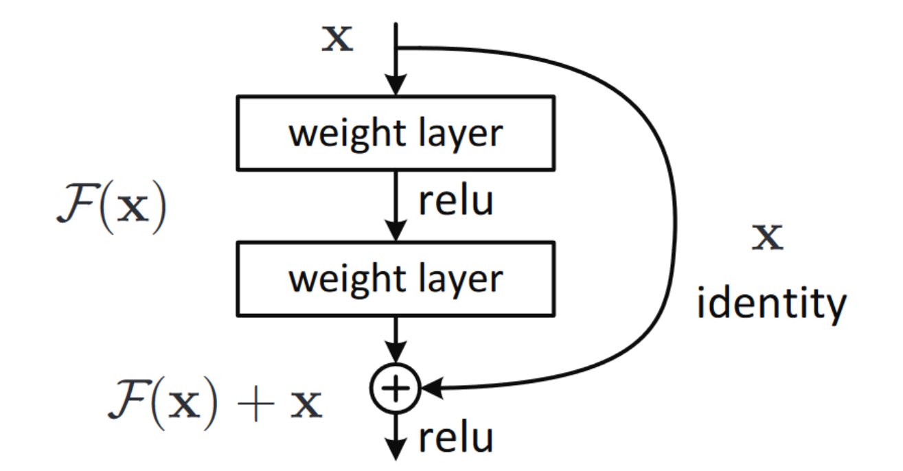
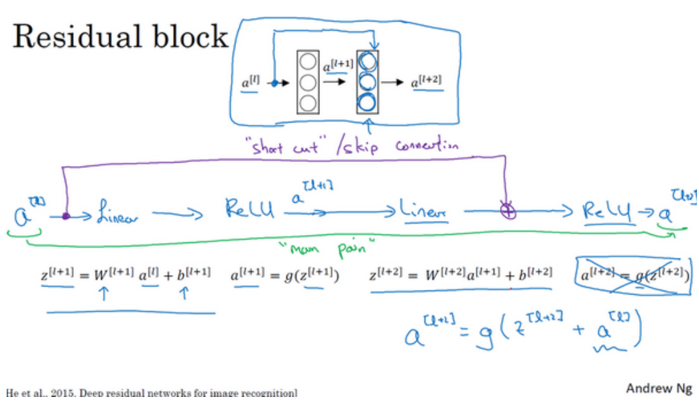
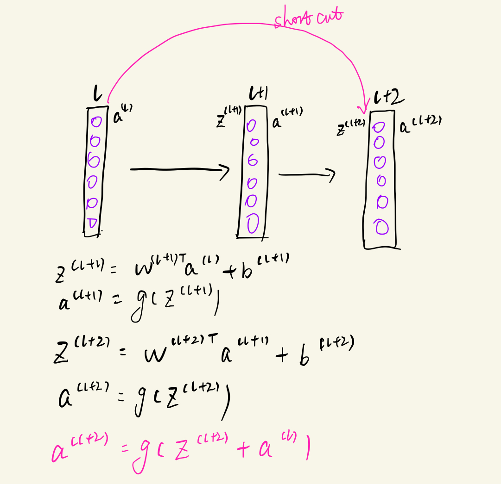

## [Deep Residual Learning for Image Recognition](https://zhuanlan.zhihu.com/p/28413039)
随着网络的加深，出现了训练集准确率下降的现象，我们可以确定这不是由于过拟合（Overfit）造成的(过拟合的情况训练集应该准确率很高)，所以作者针对这个问题提出了一种全新的网络，叫深度残差网络，它允许网络尽可能的加深，其中引入了全新的结构。    

 
多层的神经网络理论上可以拟合任意函数，那么可以利用一些层来拟合函数。如果深层网络的后面那些层是恒等映射，那么模型就退化为一个浅层网络。问题是直接拟合H(x)还是拟合残差函数F(x)=H(x)-x，拟合残差函数更简单，虽然理论上两者都能得到近似拟合，但是后者学习起来显然更容易。     

作者认为，这种残差形式是由退化问题激发的。如果增加的层被构建为同等函数，那么理论上，更深的模型的训练误差不应当大于浅层模型，但是出现的退化问题表明，求解器很难去利用多层网络拟合同等函数。但是，残差的表示形式使得多层网络近似起来要容易的多，如果同等函数可被优化近似，那么多层网络的权重就会简单地逼近0来实现同等映射，即F(x)=0。   
(用人话来说就是，输入是x，希望经过几层神经网络后，输出还近似为x，这样就相当于增加了网络深度但实际上效果等价于较浅的网络。但问题是使H(x)=F(x)=x这个函数很难拟合，而F(x)=0比较容易拟合，于是定义H(x)=F(x)+x，拟合F(x)=0就好了）   
    
如果输入是 5 ，期望经过几层网络后输出 5.1，引入残差前F'(5)=5.1，引入残差后H(5)=F(5)+5,则F(5)=0.1。  
如果输出从5.1变化到5.2那么，F'(x)的输出增加了2%，而残差结构F(x)从0.1增加到0.2，增加了100%。即残差结构对权重的调整作用更大，效果更好。残差思想就是去除相同的主题部分，突出微小的变化。  
### 吴恩达深度学习课程对残差的理解

如果我们使用标准优化算法训练一个普通网络，比如说梯度下降法，或者其它热门的优化算法。如果没有残差，没有这些捷径或者跳跃连接，凭经验你会发现随着网络深度的加深，训练错误会先减少，然后增多。而理论上，随着网络深度的加深，应该训练得越来越好才对。也就是说，理论上网络深度越深越好。但实际上，如果没有残差网络，对于一个普通网络来说，深度越深意味着用优化算法越难训练。实际上，随着网络深度的加深，训练错误会越来越多。  

结果表明，残差块学习这个恒等式函数并不难，跳跃连接使我们很容易得出。这意味着，即使给神经网络增加了这两层，它的效率也并不逊色于更简单的神经网络，因为学习恒等函数对它来说很简单。尽管它多了两层，也只把的值赋值给。所以给大型神经网络增加两层，不论是把残差块添加到神经网络的中间还是末端位置，都不会影响网络的表现。      

当然，我们的目标不仅仅是保持网络的效率，还要提升它的效率。**想象一下，如果这些隐藏层单元学到一些有用信息，那么它可能比学习恒等函数表现得更好；万一什么东西都没有学到，也只是一个恒等映射，也不会有坏处。而这些不含有残差块或跳跃连接的深度普通网络情况就不一样了，当网络不断加深时，就算是选用学习恒等函数的参数都很困难，所以很多层最后的表现不但没有更好，反而更糟。**        

NG认为残差网络起作用的主要原因就是这些残差块学习恒等函数非常容易，你能确定网络性能不会受到影响，很多时候甚至可以提高效率，或者说至少不会降低网络的效率，因此创建类似残差网络可以提升网络性能。  

### 推荐/参考：
- [Deep Residual Learning for Image Recognition](https://zhuanlan.zhihu.com/p/28413039)
- [ResNet解析](https://blog.csdn.net/lanran2/article/details/79057994)
- [吴恩达深度学习课程对残差的理解](http://www.ai-start.com/dl2017/html/lesson4-week2.html)
- [ResNet论文笔记](https://blog.csdn.net/wspba/article/details/56019373)
- [残差网络ResNet笔记](https://www.jianshu.com/p/e58437f39f65)
- [Understand Deep Residual Networks — a simple, modular learning framework that has redefined state-of-- the-art](https://blog.waya.ai/deep-residual-learning-9610bb62c355)
- [An Overview of ResNet and its Variants](https://towardsdatascience.com/an-overview-of-resnet-and-its-variants-5281e2f56035)     
- [译文](https://www.jianshu.com/p/46d76bd56766)
- [Understanding and Implementing Architectures of ResNet and ResNeXt for state-of-the-art Image Classification: From Microsoft to Facebook [Part 1]](https://medium.com/@14prakash/understanding-and-implementing-architectures-of-resnet-and-resnext-for-state-of-the-art-image-cf51669e1624)
- [给妹纸的深度学习教学(4)——同Residual玩耍](https://zhuanlan.zhihu.com/p/28413039)
