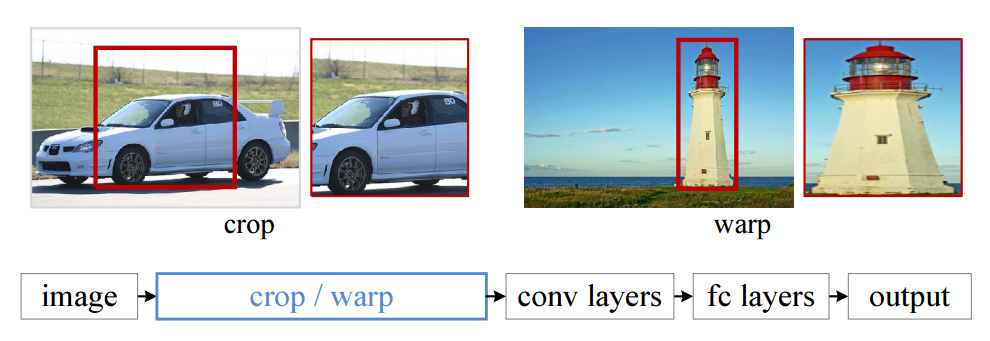
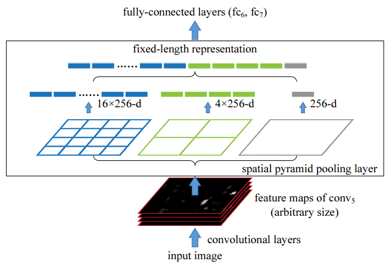

## [Spatial Pyramid Pooling in Deep Convolutional Networks for Visual Recognition](https://arxiv.org/abs/1406.4729)
### SPP-Net要解决的问题是什么？
spp提出的初衷是为了解决CNN对输入图片尺寸的限制。由于全连接层的存在，与之相连的最后一个卷积层的输出特征需要固定尺寸，从而要求输入图片尺寸也要固定。SPP-Net之前的做法是将图片裁剪或变形（crop/warp），如下图所示:
  
但裁剪或者变形，会损失图片信息，因此提出了Spatial Pyramid Pooling,可以将任意size的feature map池化成固定大小。  
SPP-Net对这些网络中存在的缺点进行了改进，基本思想是，输入整张图像，提取出整张图像的特征图，然后利用空间关系从整张图像的特征图中，在spatial pyramid pooling layer提取各个region proposal的特征。  

### 介绍下空间金字塔池化
空间金字塔池化（spatial pyramid pooling）的网络结构如下图：
  
将任意尺寸的feature map用三个尺度的金字塔层分别池化，将池化后的结果拼接得到固定长度的特征向量（图中的256为filter的个数），送入全连接层进行后续操作。  
（后来的Fast RCNN网络即借鉴了spp的思想。其中的ROI Pooling可理解为单尺度的SPP层）

#### 推荐/参考链接
- [Spatial Pyramid Pooling in Deep Convolutional Networks for Visual Recognition](https://arxiv.org/abs/1406.4729)
- [SppNet中的spatial pyramid pooling](https://www.jianshu.com/p/884c2828cd8e)
- [SPP-Net](https://www.jianshu.com/p/b2fa1df5e982)
